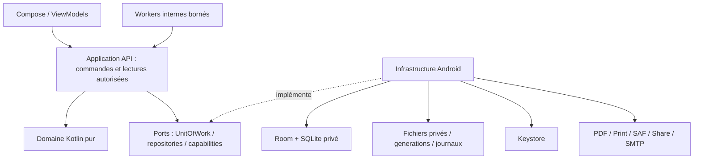
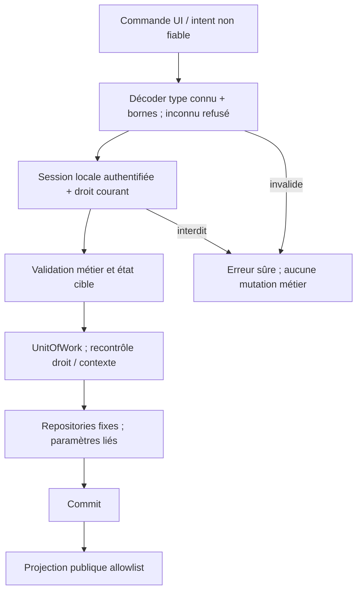
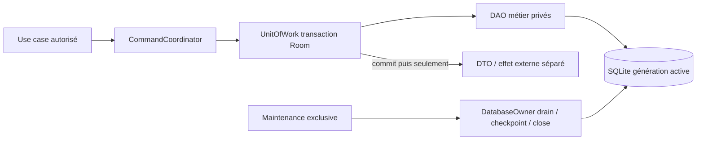
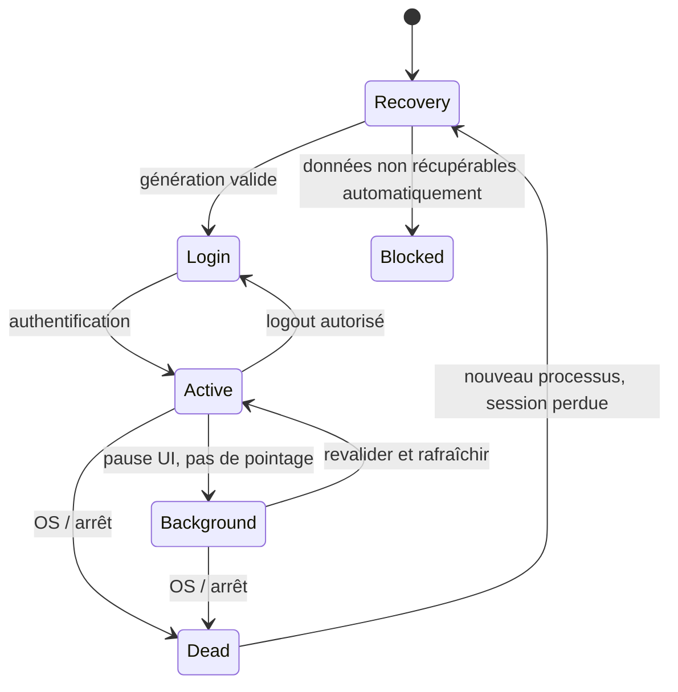
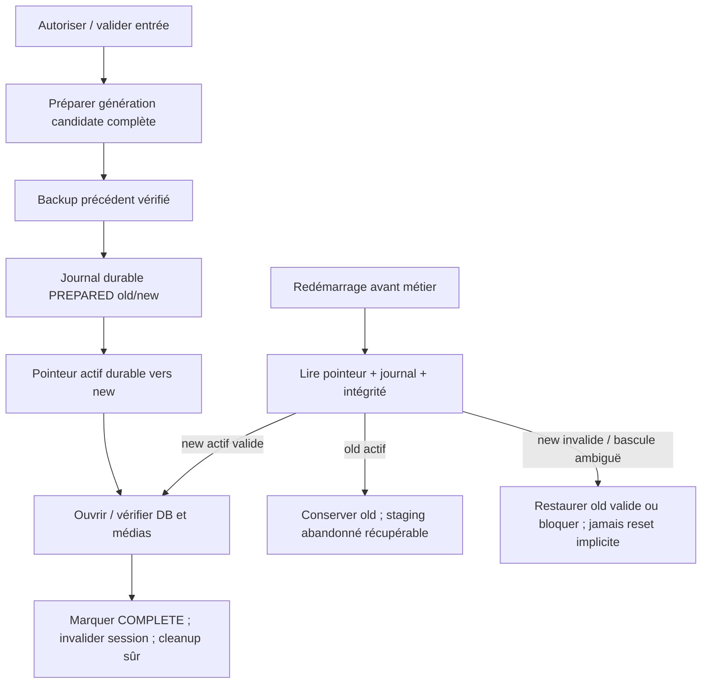

# STORE 3.0 — Android Architecture

Étape 4 · 28 septembre 2026 · architecture/documentation uniquement.

**STATUS: BLOCKED pour verrouillage complet du contrat d'implémentation.** Architecture cible sélectionnée ci-dessous ; deux mécanismes restent PROVISIONAL : snapshot/recovery sur le driver retenu (SP-01) et PDF STORE structuré (SP-02). Aucun spike n'a été exécuté. Ce document autorise leur spécification à l'étape 5, pas leur exécution ni le développement du produit.

## 1. Purpose

Définir couches, responsabilités, technologies et preuves requises pour Android autonome. LOCKED signifie décision architecturale suffisamment étayée, non implémentation certifiée. PROVISIONAL signifie qu'une preuve technique ciblée manque ; pas un choix laissé silencieusement au développeur.

## 2. Inputs

- [Functional baseline](STORE_3_FUNCTIONAL_BASELINE.md), `d99c97fe0e00cc148ebc592582f476899049de23` : 31 domaines, 24 invariants, 11 flux.
- [Portability assessment](STORE_3_PORTABILITY_ASSESSMENT.md), `4b5cbdc0437f96bc8fa9e99b3032b1570f99cdbf` : 19 capacités, risques R01–R13, questions OQ-01–10.
- Source 2.0.1 immuable : `63b3849ee234248a3b07a643e17dd22fb8c7b23d`, FUNCTIONALLY QUALIFIED, UNSIGNED. Aucun statut de qualification transféré à Android.
- Confirmation ciblée seulement : `backend/src/domain/sale/canonicalSale.ts`, `domain/auth/identity.ts`, `domain/user/user.validators.ts`, branche `createInvoice` de `database/storeDatabase.ts`. Le replay est vérifié **avant** une nouvelle vérification du stock courant : ne pas refuser une facture déjà créée parce que sa vente a consommé le stock.

Références externes officielles/mainteneurs consultées le 28 septembre 2026, citées aux décisions. Les versions finales/transitives seront épinglées dans le futur contrat et vérifiées avant installation ; aucun paquet n'est installé ici.

## 3. Architectural Principles

Android uniquement ; une installation = une autorité locale et un jeu de données. Aucune dépendance réseau du cœur. UI sans autorité privilégiée, refus par défaut, DTO explicites. Opérations métier atomiques, effets externes séparés. Pas de confiance dans un callback de fermeture. Respect intégral RF001–004 et J.4 ; aucune amélioration implicite de la baseline métier.

Priorité : exactitude, sécurité, durabilité, modularité, simplicité, coût. Ne pas convertir l'application en un moteur CRUD générique. Les sauvegardes externes sont des copies volontaires, pas une synchronisation.

## 4. Final Technology Stack

| Élément | Choix cible | Statut ADR |
|---|---|---|
| Runtime/langage | Application Android native, Kotlin/JVM, coroutines | 01 LOCKED |
| UI/navigation | Jetpack Compose, Material 3/adaptive, Navigation Compose à destinations typées | 02 LOCKED |
| État | ViewModel + StateFlow, état immuable, flux unidirectionnel ; pas store global métier dans UI | 02/08 LOCKED |
| Domaine/application | Kotlin pur, use cases explicites, ports, composition manuelle des dépendances | 03 LOCKED |
| DB | Room stable 2.8.x (2.8.5 observé), AndroidX BundledSQLiteDriver, DAO privés | 05 LOCKED ; snapshot 06 PROVISIONAL |
| Migrations | Migrations Room explicites, schémas exportés/versionnés, aucun fallback destructif | 05 LOCKED |
| Validation | Fonctions Kotlin pures et commandes typées, contrôle runtime à l'entrée | 03/07 LOCKED |
| Hash/crypto | bcrypt `at.favre.lib:bcrypt`, paramètres/parité source ; JCA SecureRandom/SHA-256/AES-GCM | 04/09 LOCKED |
| Secrets | Android Keystore pour clés AES ; ciphertext privé, pas de clé en DB | 09 LOCKED |
| Fichiers/médias | Stockage interne privé, ContentResolver + Storage Access Framework (SAF), AtomicFile pour petits marqueurs | 14 LOCKED |
| Backup/recovery | Snapshot quiescent, bundle ZIP borné en streaming, générations + pointeur durable | 06 PROVISIONAL |
| PDF | Modèle documentaire natif + PdfDocument ; codec metadata PDF STORE via PDFBox-Android candidat | 10 PROVISIONAL pour codec |
| Print/share | PrintManager/PrintDocumentAdapter ; FileProvider + ACTION_SEND | 11 LOCKED |
| E-mail | SMTP direct Eclipse Angus Mail/Activation + partage complémentaire | 12 LOCKED |
| Graphes/rapports | Modèles Kotlin, requêtes bornées, Compose Canvas + tableaux accessibles | 02/07 LOCKED |
| Localisation | Ressources Android FR/EN, locale explicite et formatters testés | 02 LOCKED |
| Tâches | WorkManager unique + rattrapage à l'ouverture | 13 LOCKED |
| Tests | JUnit 4, tests Room/migrations, Compose UI, AndroidX Test/UI Automator, appareils réels | 15 LOCKED |
| Build | Gradle Wrapper + Android Gradle Plugin/KSP ; APK signé privé ; AAB ultérieur | 16 LOCKED |

**Pourquoi pas Capacitor ?** Candidat crédible : runtime Android et pont JavaScript↔Java/Kotlin, réemploi React/TS élevé ; documentation v8 : API 24+, dépendance WebView. Il peut satisfaire la cible, mais pas en exposant SQLite/secret/fichiers génériques à JavaScript. Il faudrait maintenir une API métier native restreinte, le moteur transactionnel/recovery natif et les adaptateurs, plus la présentation web. Ce coût et la surface du pont sont peu justifiés pour Android seul et une UI téléphone à adapter fortement. Ce n'est pas une affirmation que Capacitor est intrinsèquement non sûr. [Capacitor Android](https://capacitorjs.com/docs/android).

Kotlin/Compose est retenu pour l'intégration directe DB/lifecycle/stockage/impression et une seule chaîne applicative. Contrepartie importante : pas de réemploi binaire React/TS ; porter politiques, jeux de tests, textes, modèles de rapports et actifs, pas simplement les traduire sans preuve de parité. React Native n'est pas retenu : DOM/CSS non réutilisables tels quels et besoins natifs toujours présents ; pas de bénéfice multiplateforme requis. Le coût principal est le portage initial, pas une infrastructure nouvelle.

Ces alternatives ont été examinées selon les 12 critères du contrat : parité fonctionnelle obligatoire pour toutes ; offline possible pour toutes ; natif favorisé pour sécurité/données/lifecycle et tests appareils ; Capacitor favorisé pour réemploi ; maturité et maintenabilité AndroidX favorisées ; complexité du portage natif reconnue ; aucune option choisie pour son seul coût. Pas de comparaison chiffrée artificielle.

## 5. System Architecture



Un seul processus applicatif pour DB/Workers ; pas serveur local HTTP, service réseau d'administration, plugin public ou processus écrivain parallèle. Un composant isolé de parsing PDF, si validé par SP-02, reçoit seulement des descripteurs/bytes bornés et n'a ni session ni DB : exception de confinement, pas deuxième autorité métier.

## 6. Layer Boundaries

| Couche | Possède | Interdit |
|---|---|---|
| Presentation | Écrans, gestes, état d'affichage, traduction, commande utilisateur | DAO, SQL, clés, hash, prix faisant autorité, mutation directe |
| Application | Use cases, session, policy entry points, transaction/maintenance, projections publiques | Dépendre de Compose/Activity ; accepter un acteur prétendu par UI |
| Domain | Règles vente/caisse/stock/présence/RBAC, validation, erreurs stables | Android, Room, filesystem, réseau, lecture d'heure globale cachée |
| Infrastructure | Implémentations des ports, DAO, crypto, fichiers, transport/document | Décider permissions depuis bouton visible ; retour d'entité DB brute |
| Composition root | Assemble instances et scopes, démarrage/recovery | Logique métier et endpoints génériques |

Interfaces de ports définies vers l'intérieur ; infrastructure dépend d'application/domaine, jamais l'inverse. DTO publics séparés des entités, repositories non exposés au module UI. Tests de dépendances et absence d'accès DAO depuis présentation exigés.

## 7. Trust / Security Boundary

UI, champs, fichiers importés, intents et état restauré sont non fiables. Code applicatif installé/signé, use cases et adaptateurs sont la base de confiance locale, sous le sandbox Android. Dans un même processus natif, séparation de modules **n'est pas une isolation OS contre du code arbitraire compromis** ; ni Root ni OS hostile ne sont couverts. Aucun composant privilégié exporté ; intents externes n'accordent pas une session.



Le pré-décodage identifie l'opération avant l'autorisation ; les contrôles métier complets suivent. Toute mutation relit permissions/état dans sa transaction pour éviter le décalage entre contrôle et écriture. Les lectures protégées passent aussi par use case. Aucun rôle, nom de table, chemin privé, prix autoritaire ou auteur d'audit venant de l'UI n'est fiable. Autorité interne Worker distincte d'un Owner fictif et limitée aux seules tâches prévues.

Secrets de saisie peuvent transiter brièvement par le formulaire puis le vérificateur ; jamais SavedState/logs/audit/crash report. Hash/password récupération/ciphertext ne ressortent pas dans DTO. L'émission explicitement autorisée d'un password temporaire reste un résultat spécialisé, pas un champ d'utilisateur. Les archives de sauvegarde constituent une sortie sensible privilégiée distincte, pas un état UI exporté.

## 8. Authentication & Authorization

Session en mémoire applicative : identifiant de compte, identifiant aléatoire de session, génération de données ; pas bearer token persistant ni identité déduite de SavedState. Rôles/droits relus en DB, snapshot public seulement pour affichage. Session survive rotation/recréation Activity tant que processus vivant ; après mort du processus/redémarrage : login obligatoire, caisse durable inchangée. Background seul n'ajoute ni logout ni timeout J.4. Au retour, compte actif et permissions recontrôlés avant données sensibles.

Lookup : NFC, trim et espaces conformément à `foldIdentity`, minuscules invariantes de locale ; accents conservés, ambiguïté refusée. Ne pas remplacer la règle par collation SQLite NOCASE seulement. Password sensible à casse, sans normalisation d'identité. BCrypt vérifié hors thread UI, coût source 10 comme plancher de compatibilité ; plus élevé seulement après mesure et décision explicite. Parité UTF-8, longueur, caractères non ASCII et limite bcrypt 72 octets à tester contre la sémantique source ; ne pas imposer silencieusement un pré-hash, une troncature différente ou une nouvelle restriction.

`at.favre.lib:bcrypt` fournit bcrypt Java compatible Android ; le choix n'autorise pas de crypto maison. Lockout et récupération persistent en DB ; temps injecté/testable, ne pas prétendre horloge inviolable hors ligne. [Bcrypt mainteneur](https://github.com/patrickfav/bcrypt).

Owner protégé, permissions subtractives, aucun prêt/élévation ; règles Manager/Employee identiques à Step 2 §4. Switch cible vérifiée avant remplacement, échec conserve ancienne session ; caisse ouverte et opération critique bloquent switch/logout. Présence vérifie password du signataire et garde l'acteur facilitateur distinct ; pas pointage au login/logout. Après restore/reset, invalider toute session et tout résultat attaché à l'ancienne génération.

## 9. Persistence Architecture

Room + **BundledSQLiteDriver**, pas SQLite via pont UI. Réduit les variations du moteur fourni par différents appareils ; entraîne une dépendance native à qualifier sur ABI/appareils et pages mémoire. Room 2.8.5 est la stable observée ; API minimum Room 2.8 : 23. Ne pas copier les exemples Room 3 alpha de guides mouvants dans le futur build stable. [Room releases](https://developer.android.com/jetpack/androidx/releases/room), [driver embarqué](https://developer.android.com/reference/androidx/sqlite/driver/bundled/BundledSQLiteDriver).

Un DatabaseOwner applicatif possède l'unique instance Room par génération active et contrôle ouverture/fermeture. DAO encapsulés ; lectures suspend/Flow, sans requête thread UI. Un CommandCoordinator sérialise les mutations ; une barrière de maintenance bloque nouvelles lectures/écritures, draine les travaux déjà acceptés et suspend Workers avant snapshot/restore. Aucun repository n'ouvre de connexion indépendante à l'insu du propriétaire.

WAL choisi, synchronous FULL requis pour les écrivains, FK actifs, busy borné ; config vérifiée sur les connexions effectives, pas par une seule requête de contrôle hors contexte. Transactions Room/driver appartenant au use case : aucun commit intermédiaire, aucune coroutine enfant détachée dans transaction, aucun SMTP/PDF/copie lourde pendant vente. Busy ne déclenche pas répétition aveugle d'une opération à effet externe. [SQLite pragmas](https://sqlite.org/pragma.html), [Room requêtes async](https://developer.android.com/training/data-storage/room/async-queries).



Migrations manuelles versionnées, schémas exportés, tests chaque chemin supporté ; aucun `fallbackToDestructiveMigration`. Backup avant migration sur DB existante avant ouverture migrante ; validation après migration. Base trop récente/downgrade refusé sans reset. `quick_check` au démarrage selon contrôle borné, `integrity_check` et `foreign_key_check` sur staging/backup/release, pas coût complet à chaque vente. Moteur/busy/WAL et snapshot réel font partie SP-01. [Migrations Room](https://developer.android.com/training/data-storage/room/migrating-db-versions).

## 10. Data Model Strategy

**A : conserver étroitement le modèle logique**, adapté au mapping Room, sans compatibilité binaire Desktop. Version mobile initiale 1, indépendante de migration Desktop 18. Garder comptes/rôles/refus/profils, produits/médias, caisse, factures/lignes/paiements, stock/mouvements, inventaires, achats/fournisseurs, présences/corrections, messages/notifications/queue, paramètres/audit.

FK, contraintes d'unicité et statuts traduits préservent les mêmes relations/invariants. Snapshots facture/prix/audit restent historiques ; graphe/KPI dérivé, jamais seconde vérité. Données techniques nouvelles limitées à génération, recovery, version canonicalisation et traitement de commandes ambiguës ; aucun import de DB Desktop requis.

Parité monétaire : conserver sémantique binary64/arrondis aux points actuels, avec fonctions Kotlin explicitement équivalentes et fixtures, pas conversion implicite à arrondi bancaire. Quantités entières avec bornes sûres source ; valeurs virgule/point normalisées avant commande. Commande canonique conserve valeurs demandées non arrondies, indépendantes des montants comptabilisés. Dates/calendriers par rapport documentés depuis Step 2, pas correction universelle inventée pendant portage.

## 11. Transactions & Idempotency

Vente : décoder → session/droit → transaction → relire droit et caisse ouverte de l'acteur → canonicaliser → rechercher clé. Si facture existante : acteur, même caisse actuellement ouverte, statut validé et preuve équivalente obligatoires ; sinon CONFLICT. Preuve absente/NULL : refus, aucun backfill. **Ne pas revalider le stock courant pour ce replay.** Pour nouvelle commande seulement : articles/stock/remise/reçu → facture+lignes+paiement+stock+mouvements+preuve → commit. Trace d'audit explicite seulement selon couverture Step 2 ; ne pas promettre audit universel absent en source.

Représentation mobile versionnée : liste triée de tuples `(articleId, quantité)` avec doublons conservés ; remise demandée défaut zéro ; reçu marqué OMITTED ou EXPLICIT avec valeur numérique exacte validée. Serialisation canonique propre au mobile, indépendante de l'ordre JSON, comparée comme structure normalisée ; pas besoin de compatibilité textuelle Desktop. Normaliser -0 comme 0, rejeter non fini, maintenir distinction omission/explicite et ne pas fusionner les lignes. Contrainte clé unique en DB, preuve écrite dans la même transaction.

Intent de validation : clé stable allouée avant soumission, commande figée tant que résultat ambigu ; jamais nouvelle clé automatique après timeout. Un enregistrement privé de commande en attente (pas du panier en édition) permet récupération après mort de processus : aucun commit automatique au relancement, re-login puis résolution explicite par use case. Si caisse fermée/acteur différent, pas replay réussi ; historique autorisé permet consulter la facture sans prétendre réussite du replay.

| Opération | Unité atomique / contrôle |
|---|---|
| Annulation vente | État/motif/droit + paiement compensé + stock/mouvements + statut ; une seule compensation |
| Validation inventaire | Draft/comptages + comparaison stock courant + deltas/mouvements + statut |
| Validation achat | Lignes/état + réception stock/mouvements + statut ; aucune deuxième réception |
| Annulation achat | État/motif/stock suffisant + compensation + statut, sinon rollback intégral |
| Permissions | Owner/cible/caisse/état attendu + refus subtractifs + audit, conflit sans écriture partielle |
| Correction présence | Droit/intervalle/motif + originaux/correcteur/correction + audit prévu |
| Médias | Préparation durable avant référence, commit DB, cleanup après commit ; RF001, pas fausse transaction fichiers+DB |
| Restore/reset | Protocole génération/journal §16, non une transaction SQL prétendant couvrir le filesystem |

## 12. Android Lifecycle

ApplicationOwner initialise recovery **avant** DB/migrations/UI métier/Workers. Aucun succès déduit de `onStop`/`onDestroy`. Opération critique appartient au scope application, pas à l'écran ; disparition de l'écran ne peut laisser une transaction partielle. Mort du processus : SQLite rollback ou commit durable ; réponse inconnue traitée via clé/historique. Rotation ne soumet rien.

Session et UI privées ne sont pas restaurées aveuglément. Résultats asynchrones marqués génération/session ; rejet des anciens après switch/restore. Au retour foreground : recovery prêt, revalidation session, refresh des données visibles. Faible mémoire/espace : traitement en streaming et pagination, erreur sûre, aucune purge d'historique pour « réparer ».

## 13. State Ownership

| État / propriétaire | Recomposition | Recréation Activity, processus vivant | Mort processus / restart |
|---|---|---|---|
| Filtres/position/navigation non sensibles, ViewModel/SavedState | Oui | Oui | Restoration facultative bornée, après auth et droits |
| Password/réponse sécurité formulaire | Éphémère | Effacé lors destruction formulaire ; resaisie sûre | Jamais persisté |
| Session, Application SessionManager | Oui | Oui | Non : login obligatoire |
| Panier/édition non validée, ViewModel | Oui | Oui | Non garanti, avertissement ; pas extension générale drafts |
| Commande soumise/résultat ambigu, journal privé | Oui | Oui | Oui, résolution autorisée, jamais auto-vente |
| Draft achat/inventaire déjà enregistré, DB | Oui | Oui | Oui ; reprise éditeur complète toujours différée |
| Métier committé, DB | Oui | Oui | Oui sous garanties de stockage, pas garantie contre panne matérielle totale |
| Recovery/archives en cours, journal privé | Oui | Oui | Oui, reprise avant métier |



ViewModel ne survit pas à une mort de processus ; SavedState n'est pas une DB ni un coffre de secrets. [État UI Android](https://developer.android.com/topic/libraries/architecture/saving-states), [ViewModel](https://developer.android.com/topic/libraries/architecture/viewmodel).

## 14. Files & Media

Stockage interne, hors sauvegarde système automatique : `generations/<id>/` contient DB+médias immuables gérés ; `maintenance/` journaux/staging ; `backups/` archives complètes ; `cache/exports/` seulement copies régénérables. Pas chemin Windows, pas `MANAGE_EXTERNAL_STORAGE`, pas accès arbitraire donné à UI.

SAF pour sélection/import/export ; ContentResolver lit le flux reçu, pas conversion d'URI en chemin supposé. Copier les entrées dans staging privé borné avant usage durable. Destination utilisateur peut être indisponible/révoquée/distante : le cœur reste local et l'export échoue explicitement. Pas fournisseur cloud imposé. [SAF](https://developer.android.com/training/data-storage/shared/documents-files).

JPEG/PNG/WebP et bornes Step 2 conservées ; contrôle signature/contenu attendu et limites de décodage d'aperçu. Noms gérés aléatoires, références relatives allowlist, rejet traversal et collisions. MediaWriter prépare fichier durable puis transaction change référence ; post-commit seul nettoyage non référencé, échec cleanup garde orphelin. Capture caméra non ajoutée implicitement ; sélection d'image suffit.

AtomicFile utilisé pour petits marqueurs uniquement, avec verrou applicatif : ce n'est ni mutex ni transaction multi-fichiers. Les opérations critiques ne vivent pas dans cache effaçable. [AtomicFile](https://developer.android.com/reference/android/util/AtomicFile).

## 15. Secure Storage

Hash de vérification et lockout dans SQLite privée ; jamais password en clair. Clés AES-GCM non exportables dans Android Keystore ; secrets SMTP chiffrés avec nonce aléatoire non réutilisé et version d'enveloppe, ciphertext en stockage privé. Matériel sécurisé quand disponible, sans exiger StrongBox universel ; perte/invalidité clé = secret indisponible, pas fallback plaintext. [Keystore](https://developer.android.com/privacy-and-security/keystore).

Clé sans confirmation biométrique par envoi pour permettre tâches autorisées après déverrouillage appareil ; ne pas utiliser les Workers avant accès au stockage utilisateur. Credentials SMTP ne ressortent jamais à présentation : seulement état configuré/non disponible. Backup peut contenir ciphertext, **jamais clé** ; sur autre installation, reconfiguration SMTP nécessaire, queue bloquée sans épuiser les essais. Pas garantie de chiffrement intégral DB/archive ; données personnelles et hashes rendent toute sauvegarde sensible.

Désactiver backup système cloud et transfert implicite des données métier/secrets via règles Android applicables, pas seulement un booléen supposé universel ; qualification OEM exigée. Export STORE volontaire reste disponible. Désinstallation efface données privées/clé : avertissement et backup externe préalable ; contrairement au Desktop, ne pas promettre conservation du profil. [Auto Backup et limites](https://developer.android.com/identity/data/autobackup).

## 16. Backup / Restore / Reset

**Protocole retenu, adaptateur PROVISIONAL SP-01.** Pas de copie naïve d'une DB active, pas dépendance à fermeture normale.

Backup : maintenance exclusive → drainer lectures/écritures/Workers → checkpoint WAL vérifié réussi → fermer toutes connexions → copier DB stable et médias référencés vers snapshot privé → rouvrir génération active → contrôler copie/intégrité/FK/références → ZIP en streaming avec manifeste version mobile/schema/app/tailles/SHA-256 → flush/sync et publication interne → rétention 7 automatiques. Aucune suppression des manuelles/pré-opération. Échec checkpoint/close/copie : abort sans effacer WAL. Manifestes prouvent intégrité accidentelle, pas authenticité face à un attaquant.

Export vers URI externe depuis archive interne complète ; fermeture/erreur stream vérifiée, relecture hash quand possible ; ne pas annoncer atomicité du fournisseur externe ni durabilité physique non démontrée. Afficher état export non vérifié si vérification impossible ; archive interne conservée.

Restore : Owner courant autorisé + confirmation ; archive copiée/validée en staging avec bornes compressées/décompressées, nombres d'entrées, noms exacts, pas symlink/zip-slip/entrées dupliquées ; schéma supporté/Owner actif/intégrité/FK/médias. Valider/migrer la **copie** candidate avant activation, jamais l'actif pour essayer. Pré-backup vérifié obligatoire, puis journal de transition old/new. Nouvelle génération complète flushée ; bascule du petit pointeur actif par AtomicFile sous verrou ; vérification ouverture avant d'autoriser métier. Ancienne génération et backup gardés jusqu'à finalisation durable.



Reset : Owner + password propre + confirmation + safety backup, nouvelle génération vide avec schéma valide ; même protocole de bascule. Avant bascule, ancien métier reste autoritaire ; après bascule durable, finaliser reset et cleanup sans retour silencieux des anciens comptes. Journaux distinguent RESTORE/RESET et décision de bascule ; backups hors génération non supprimés. Aucun nettoyage avant certitude de l'état. Reprise sans session autorisée seulement pour achever/récupérer l'opération préalablement autorisée enregistrée, jamais créer un nouveau reset.

**SP-01 minimal (bloquant, à autoriser séparément)** : petit banc Android isolé Room/driver/version cible, DB synthétique + deux médias ; transaction vente/RF004 ; checkpoint/quiescence ; snapshot ; génération/pointeur/journal. Tuer processus à chaque point avant/après flush/bascule, injecter espace faible et corruption candidate, redémarrer. Vérifier invariant old complet OU new complet, FK/intégrité, absence double effet, pragmas sur connexions, reprise Workers ; test min API et appareil arm64 à pages 16 Kio. Aucune donnée réelle. Si primitives ne suffisent pas : décision DB/recovery à réouvrir, pas bricolage de suppression WAL.

## 17. PDF / Print / Share / Email

PDF facture/rapport : snapshot métier autorisé immuable → DocumentModel (titres, période/filtres, date/heure, colonnes, montants, graphe) → pagination native → PdfDocument sur fond blanc/texte contrasté. Même modèle pour aperçu/document, pas screenshot du thème actif. Polices/glyphes FR/EN/FCFA, coupures de tableaux, pages et tailles bornées à tester. Contenu déterministe pour même snapshot, pas obligation d'octets identiques avec metadata temporelle. API native offline documentée. [PdfDocument](https://developer.android.com/reference/android/graphics/pdf/PdfDocument).

Catalogue PDF STORE structuré : capacité Step 2 H obligatoire, distincte d'un rapport lisible. PdfDocument seul ne lit pas la metadata importée. **PDFBox-Android candidat pour lecture/écriture du Subject STORE_DATA_V1 uniquement**, derrière port StructuredCatalogCodec ; pas parser maison ni suppression de la fonction. Le mainteneur documente Android/API19 et Apache-2.0, mais README fondé sur PDFBox 2.0.27 ne suffit pas à établir maintenance/correctifs et sûreté du parser pour ce contrat. [Projet mainteneur](https://github.com/TomRoush/PdfBox-Android).

**SP-02 minimal (bloquant, à autoriser séparément)** : vérifier release/maintenance/advisories et dépendances du codec ; corpus synthétique STORE export→import et fichiers inconnus/chiffrés/tronqués/metadata excessive ; lecture bornée, délais/mémoire, zéro accès DB/réseau depuis parser, aucun import partiel ; API minimum/arm64/release minifiée. Évaluer confinement parsing en service isolé avec descripteur readonly et interruption contrôlée. Validation inclut compatibilité de la convention catalogue conservée, pas DB Desktop. Si maintenance insuffisante ou bornes impossibles : ne pas accepter le paquet ; réouvrir ADR10 pour autre codec maintenu. Aucun spike exécuté maintenant.

Impression : PrintManager + PrintDocumentAdapter servant PDF autorisé ; annulation/périphérique absent visibles, jamais nouvelle vente. Partage : FileProvider non exporté, URI temporaire read-only, ACTION_SEND/chooser, nettoyage différé hors usage ; pas chemin brut. [Impression](https://developer.android.com/training/printing/custom-docs), [partage sûr](https://developer.android.com/training/secure-file-sharing/share-file).

SMTP **conservé**, partage également proposé mais ne marque jamais queue SMTP « sent ». Eclipse Angus Mail + Activation, Android supporté officiellement ; pas SASL présumé, pas OAuth ajouté à la baseline. Transport natif hors UI, timeouts, TLS implicite ou STARTTLS obligatoire avant secrets, validation hostname/certificat, aucun trust-all ni debug contenant credentials. La restriction des configurations SMTP non sûres est un durcissement explicite du transport mobile : anciennes configurations plaintext refusées avec message, pas dégradation cachée. Queue/états/retry Step 2 conservés. [Angus Android](https://eclipse-ee4j.github.io/angus-mail/Android).

Pièce jointe issue uniquement d'un document interne autorisé ; pas URI externe arbitraire envoyé par la bibliothèque. Réception SMTP acceptée signifie remise au serveur, pas lecture/délivrance finale. Crash après remise avant statut local peut provoquer doublon : limite déclarée, pas exactly-once inventé. Aucun serveur STORE créé.

## 18. Adaptive Phone / Tablet UI

Classes de largeur disponible : COMPACT <600dp, MEDIUM 600–839dp, EXPANDED ≥840dp ; recalcul à rotation/redimensionnement, pas détection « modèle tablette ». Employer APIs adaptive Material 3. [Classes Android](https://developer.android.com/develop/ui/compose/layouts/adaptive/use-window-size-classes).

- Navigation : destinations typées filtrées par droits, retour système préserve contexte et garde mutation/caisse ; invalider destinations devenues interdites après switch. Pas deux commandes identiques concurrentes.
- POS : compact catalogue et panier en étapes/panneaux réversibles avec total accessible ; medium/expanded liste-détail quand largeur suffisante. Ne pas diminuer les cibles pour conserver deux colonnes.
- Tables : projection compacte ligne/fiche avec tous attributs accessibles ; grands écrans colonnes alignées ; pagination/scroll de zones indépendantes, pas chargement infini en mémoire.
- Rapports : modèles/graphiques Canvas, séries distinguées par légendes et alternatives textuelles ; toucher pour détails, tableaux dépliables conservés. Pas hover-only.
- Formulaires/dialogues : clavier/IME/insets pris en compte, focus stable, password non sauvegardé, validation/retry lisibles ; dialogue plein écran compact si nécessaire. Aucun changement métier selon orientation.
- Administration/aide : mêmes fonctions autorisées, liste-détail adaptative, actions destructrices séparées et confirmées. Touch targets au moins 48dp comme règle STORE, contraste et lecture TalkBack à qualifier.

## 19. Offline-First Model

OFFLINE CORE : login/RBAC, caisse/POS/factures, catalogue/stock/achats/inventaires, équipe/présence, rapports, chat local/alertes, paramètres, audit, PDF, backup/restore/reset privé, aide. OPTIONAL CONNECTED : export vers destination choisie et impression selon périphérique ; leurs échecs n'altèrent pas métier. NETWORK-DEPENDENT OPTIONAL à l'exploitation : SMTP (fonction requise, connectivité facultative), partage via application externe selon celle-ci.

Pas télémétrie obligatoire, remote API, cloud auth, licence réseau au lancement. Horloge et données locales ne deviennent pas « vérifiées par serveur ». Aucun push inter-appareil.

## 20. Background Work

WorkManager pour travaux persistants uniques : contrôle backup automatique quotidien avec rattrapage à ouverture, retries e-mail contraints réseau, cleanup sûr opportuniste. Pas service permanent ni intervalle 2 minutes garanti ; planification OS différée et périodique minimum 15 minutes, backoff métier distinct. Forcer arrêt peut empêcher exécution jusqu'à relancement : pas promesse de deadline. [WorkManager](https://developer.android.com/develop/background-work/background-tasks/persistent), [contraintes et périodicité](https://developer.android.com/develop/background-work/background-tasks/persistent/getting-started/define-work).

Worker passe par mêmes coordinateurs/barrière/génération. Envoi créé par acteur autorisé ; relance automatique ne forge pas session, vérifie compte/droit courant applicable et configuration ; refus suspend sans envoyer. Backup système interne borné après Owner actif, pas permission UI contournée. Maintenance user longue : progression et reprise journalisée ; OS peut tuer le processus, aucune confiance dans maintien foreground pour intégrité. Diagnostics complets à demande, pas scan permanent coûteux.

## 21. Testing Architecture

| Niveau | Preuves futures obligatoires |
|---|---|
| Domain JVM/JUnit | Validation, arrondis, Unicode/identité, quantités, RBAC, canonicalisation ; jeux de cas TS portés en fixtures synthétiques |
| Use cases | Acteur forgé, état concurrent, suppression inconnue, Owner/refus, J.4, DTO sans secrets, absence effets en refus |
| DB/transactions sur moteur réel | RF004 replay exact/NULL/caisse/acteur/commande, atomicité et rollback des opérations §11, contention |
| Migrations Room | Base neuve, chaque version mobile supportée→cible, restart, mauvais schéma, aucune migration destructive |
| Adaptateurs | Secrets invalidés, SAF annulé/révoqué, images invalides, export plein, PDF, impression, SMTP TLS/queue/retry |
| Compose UI | Saisie password continue, retour, clavier, français/anglais, thème, focus/toucher, téléphone/tablette |
| Android integration | Composition réelle des use cases/Room/Keystore/Workers, min API et API cible, ABI/pages 16 Kio |
| Lifecycle | Rotation, Activity recreation, kill processus externe réel (pas seulement recréer Activity), background/force-stop/update |
| Backup/recovery | SP-01, fichiers manquants/tampering/zip bombs, mort à chaque phase, ancien ou nouvel état entier |
| Release acceptance | APK signé installation/update même identité, données/clé, sauvegarde externe avant uninstall, PDF/print réel, appareil faible, absence réseau |

Porter conceptuellement RF001 média, RF002 identité publique, RF003 historique, RF004 idempotence, J.4 session et tests métier cash/purchase/presence/reporting/reset/restore. 291 PASS Desktop ne remplace aucun de ces gates. Pas de tests exécutés ni écrits pendant cette étape.

## 22. Build & Release

Application Android distincte sous racine future séparée, **minSdk 23**, compileSdk/targetSdk **36 comme base de qualification initiale** ; pas déclaration que 36 est la dernière version ou conforme à toute future politique Store. Revalider à diffusion, sans changer le périmètre appareil silencieusement. Kotlin/JDK/AGP/Gradle/KSP/Compose/Room versions stables compatibles à épingler et vérifier dans le contrat ; pas alpha, pas versions dynamiques. API 23 est un plancher technique, pas recommandation d'utiliser un appareil sans correctifs OS. [SDK Android 16](https://developer.android.com/about/versions/16/setup-sdk).

Gradle Wrapper reproductible, catalogue de versions, vérification dépendances/notices ; build debug applicationId suffixé et données synthétiques séparées. Release minifiée testée, pas debug/secret/fixtures embarqués. APK signé pour diffusion privée initiale ; AAB seulement si publication ultérieure autorisée. Rien généré maintenant. [Build Android](https://developer.android.com/build/building-cmdline).

Nom logique STORE by VIBE ; applicationId stable à réserver au contrat avant premier build distribué. versionName 3.0.0 au premier release, versionCode strictement croissant ; signature release obligatoire, clé conservée hors repo avec copie protégée. Même package/clé compatibles pour update, migrations testées ; pas downgrade destructif ni auto-update maison. Uninstall supprime privé, pas automatiquement les exports choisis. [Signature Android](https://developer.android.com/studio/publish/app-signing).

## 23. Module Structure & Coverage

Structure proposée, aucun dossier créé :

```text
store-android/
  app/                  composition, lifecycle, navigation root, Workers
  presentation/         Compose + ViewModels, dépend application-api
  application-api/      commandes typées, DTO publics, interfaces use cases
  application/          auth/session, use cases, ports, coordinators
  domain/               Kotlin pur : politiques/valeurs/invariants
  infrastructure/       Room, crypto, files, documents, SMTP, recovery
  testing/              fixtures synthétiques et harnesses futurs
```

Séparation en modules de compilation pour interdire dépendance presentation→infrastructure ; fonctionnalités regroupées en packages, pas 31 microservices. Reprendre actifs autorisés, textes FR/EN et cas de tests ; porter règles TypeScript en Kotlin avec parité, pas intégrer Node dans l'app.

| Domaines Step 2 | Propriétaire application / adaptateurs | Couverture |
|---|---|---|
| A identité, B rôles, C session | IdentityAccess + SessionManager + bcrypt/Room | 3 |
| D accueil | DashboardQuery + Compose | 1 |
| E caisse, F vente, G facture | Cash/Sale/Invoice + UnitOfWork + documents | 3 |
| H articles, I médias, J stock, K mouvements, L inventaires | Catalog/Stock/Inventory + MediaStore | 5 ; H codec PROVISIONAL |
| M achats, N fournisseurs | Purchase/Supplier + Room | 2 |
| O équipe, P présence | Team/Attendance + validation personnelle | 2 |
| Q rapports, R messagerie, S e-mail | Reporting/Messaging/Delivery + document/SMTP | 3 |
| T paramètres, U audit | Settings/Audit + SecretStore | 2 |
| V backup, W restore, X reset, Y diagnostics | Maintenance + RecoveryCoordinator | 4 ; V/W/X adaptateur PROVISIONAL |
| Z locale, AA accessibilité, AE aide/navigation | Presentation + ressources + Help/document | 3 |
| AB frontière, AC persistance, AD recovery | Application/Infrastructure transverses | 3 |

Total **31/31 adressés architecturalement**, pas 31 validés en exécution.

| Capacités Step 3 | Mécanisme choisi |
|---|---|
| C01 DB, C02 transactions, C03 migrations | Room/BundledSQLite/UnitOfWork/migrations manuelles |
| C04 autorité, C05 crypto, C06 secrets | Use cases/session, bcrypt/JCA, Keystore |
| C07 fichiers, C08 médias, C09 import/export | Stockage privé/MediaStore logique/SAF |
| C10 recovery | Générations/journal/snapshot, SP-01 |
| C11 PDF | PdfDocument + codec candidat, SP-02 |
| C12 print, C13 e-mail, C14 lifecycle | PrintManager, Angus/queue, ApplicationOwner/WorkManager |
| C15 UI, C16 permissions, C17 diagnostics | Compose adaptive, permissions minimales/URI grants, service santé local |
| C18 packaging, C19 partage | Gradle/APK signé, FileProvider/chooser |

Total **19/19 adressées**, C10 et composante structurée C11 non verrouillées.

## 24. Technology ADRs

Une décision par ligne : **14 LOCKED, 2 PROVISIONAL**. Les détails des sections référencées font partie de la décision, pas des options supplémentaires implicites.

| ADR / Decision | Chosen option | Alternatives considered | Why chosen / trade-offs | Risks addressed | Lock status |
|---|---|---|---|---|---|
| 01 Runtime | Kotlin Android natif | Capacitor/React ; React Native | Intégration unique locale ; réécriture UI et parité TS coûteuses | R02/R07/R09 | LOCKED |
| 02 UI/state/navigation | Compose/Material3/Nav/ViewModel/StateFlow | Réemploi DOM | Adaptive/OS direct ; nouveaux composants à qualifier | R09/R13 | LOCKED |
| 03 Layers/trust | Use cases typés, ports, modules | DAO UI / SQL générique | Autorité centralisée ; séparation logique non sandbox intra-processus | R02 | LOCKED |
| 04 Auth | bcrypt favre + session mémoire | bcrypt JS embarqué ; cloud auth | Android documenté, aucune élévation ; parité encodage/latence requise | R02/R06/R07 | LOCKED |
| 05 Persistence | Room/BundledSQLite, migrations explicites | SQLite plateforme brut ; driver JS | Moteur contrôlé/DAO/migrations ; taille binaire et adaptation | R01/R03 | LOCKED |
| 06 Maintenance | Snapshot quiescent + générations/journal + ZIP stream | Copie DB ouverte ; remplacement in-place | Moins d'états mixtes ; checkpoint/flush/reopen à prouver SP-01 | R03/R04/R05/R08 | PROVISIONAL |
| 07 Transactions/parité | UnitOfWork, canonicalisation versionnée | Calcul UI autoritaire ; nouvelle clé au retry | RF004 exact, audit limité source ; fixtures de parité nécessaires | R01/R12 | LOCKED |
| 08 Lifecycle | Session volatile, état distinct, journal commande soumise | Persist session/password ; timer permanent | Mort processus traitée ; resaisie panier possible | R07 | LOCKED |
| 09 Secrets | Keystore AES-GCM + privé | Plaintext ; clé incluse backup | Pas clé exportée ; reconfiguration SMTP après perte clé | R06 | LOCKED |
| 10 Documents | PdfDocument + candidat PDFBox-Android pour codec | Screenshot UI ; suppression import ; parser maison | Offline et modèle déterministe ; maintenance/parser à prouver SP-02 | R08/R10 | PROVISIONAL |
| 11 Print/share | PrintManager + FileProvider/intent | Impression Desktop ; chemins publics | APIs Android, pas accusé livraison garanti | R05/R10 | LOCKED |
| 12 Email | Angus SMTP + partage complémentaire | Share seulement ; serveur STORE | Préserve queue réelle ; TLS/configuration et doublons externes gérés | R06/R11 | LOCKED |
| 13 Background | WorkManager + rattrapage | Service toujours actif ; timers | Scheduling système ; aucune deadline garantie | R07/R11 | LOCKED |
| 14 Files | Privé + SAF + références gérées | Accès stockage global | Moindre privilège ; URI/export non forcément atomique | R05/R08 | LOCKED |
| 15 Tests | JVM + moteur réel + Android/kill-process | 291 tests Desktop seuls | Preuves adaptées, matériel/coût humain requis | R01–R13 | LOCKED |
| 16 Release | Gradle APK privé signé, update compatible | Electron-builder ; cloud obligatoire | Android indépendant ; responsabilité clé/versioning | R03 | LOCKED |

## 25. Step-2 Questions Resolution

RESOLVED = décision définie, encore soumise aux tests normaux futurs ; BLOCKS = preuve de sélection indispensable manquante.

| Question | Résolution | Réponse |
|---|---|---|
| OQ-01 frontière | RESOLVED | §6–8, use cases natifs, pas SQL UI |
| OQ-02 stockage/RF004 | RESOLVED | §9–11 Room/transactions/commande ; recovery spécialisé reste OQ-05 |
| OQ-03 lifecycle/session | RESOLVED | §12–13 mémoire/session et état durable distincts |
| OQ-04 médias | RESOLVED | §14 RF001/references/copie privée, sécurité publication testée via SP-01 |
| OQ-05 backup/restore | BLOCKS IMPLEMENTATION CONTRACT | Protocole §16 retenu, adaptateur snapshot/recovery SP-01 non prouvé |
| OQ-06 background | RESOLVED | §20 WorkManager/rattrapage, pas timers garantis |
| OQ-07 PDF/print | BLOCKS IMPLEMENTATION CONTRACT | Print/share décidés ; codec PDF STORE requis SP-02 non verrouillé |
| OQ-08 secrets | RESOLVED | §15 Keystore/ciphertext/reconfiguration sans clé |
| OQ-09 UI | RESOLVED | §18 native adaptive, pas écrans Desktop réduits |
| OQ-10 qualification | RESOLVED | §21–22 scénarios/versionnement/données/uninstall explicites |

**8/10 resolved ; 2 blocking.** Pas approbation de réduire le périmètre pour contourner ces deux blocs.

## 26. Step-3 Risk Resolution

Mitigated signifie stratégie crédible et propriétaire explicite, **pas risque éliminé par des essais**. R03/R04/R05/R08 gardent une preuve bloquante SP-01/02 ; pas de risque high sans stratégie.

| Risk | Mitigation | Architectural owner | Residual risk / gate |
|---|---|---|---|
| R01 critical transaction | UnitOfWork + écrivain sérialisé + replay transactionnel | Application/DB | Driver réel, concurrence et coupures à tester |
| R02 critical autorité | API native restreinte, droits courants, DTO, modules | IdentityAccess | Même processus/OS compromis hors garantie ; tests directs |
| R03 critical migration/durabilité | Moteur embarqué, migrations non destructives, FULL/FK contrôlés | DatabaseOwner | SP-01 et update réels bloquants avant verrouillage recovery |
| R04 critical recovery | Générations + journal/pointeur, ancien état conservé | RecoveryCoordinator | SP-01 : preuve crash/flush requise |
| R05 high fichiers | SAF/privé, préparation RF001, publication contrôlée | MediaStore/Recovery | Fournisseur externe non atomique ; SP-01 |
| R06 high secrets | Keystore/GCM/DTO minimal/TLS, pas fallback plaintext | SecretStore/Identity | Perte clé/OS non corrigé ; reconfiguration et tests |
| R07 high interruption POS | Session mémoire, journal soumis, aucune auto-vente | Session/SaleCoordinator | Saisie volatile perdue, résultat ambigu résolu explicitement |
| R08 high mémoire/espace | Streaming/quotas/pagination/staging contrôlé | Maintenance/Documents | SP-01/02 bornes et appareil faible |
| R09 high téléphone | Compose adaptive, IME, cibles tactiles/retour | Presentation | Qualification humaine/device encore nécessaire |
| R10 medium documents | Modèle clair natif/print système/codec contrôlé | Documents | SP-02 + imprimantes/pagination |
| R11 medium SMTP/timers | Angus/WorkManager, queue durable/rattrapage | Delivery | Délai OS, duplication SMTP déclarée |
| R12 medium nombres/dates | Fonctions de compatibilité et fixtures | Domain/Reporting | Aucune réinterprétation silencieuse des calendriers source |
| R13 medium accessibilité | Sémantique Compose/TalkBack/tableaux | Presentation | Tests tactile/lecteur/contraste |

Critical/high avec mitigation : **9/9** ; sans mitigation crédible : **0**. Cela ne lève pas le STOP relatif aux preuves de sélection manquantes.

## 27. Cost / Licensing & Evidence Limits

Pas coût récurrent d'infrastructure STORE, pas technologie payante obligatoire sélectionnée. Matériel/test, temps de développement, connectivité et éventuel compte SMTP peuvent coûter ; fournisseur SMTP choisi par l'utilisateur. Publication en boutique ultérieure n'est pas nécessaire à l'APK privé.

| Technologie | Licence / coût direct attendu | Paiement commercial / lock-in |
|---|---|---|
| Kotlin | Apache-2.0, pas redevance runtime | Non ; dépendance langage JVM. [FAQ Kotlin](https://kotlinlang.org/docs/faq.html) |
| AndroidX Compose/Room/WorkManager etc. | Apache-2.0, notices à distribuer | Non ; dépendance Android/Jetpack. [AndroidX licence](https://github.com/androidx/androidx/blob/androidx-main/LICENSE.txt) |
| SQLite embarqué | Domaine public | Non ; SQL/schema à maintenir. [SQLite copyright](https://sqlite.org/copyright.html) |
| Gradle / JUnit 4 | Apache-2.0 / EPL-1.0, outillage de build/test | Pas paiement requis ; notices et transitives à inventorier. [Gradle licence](https://github.com/gradle/gradle/blob/master/LICENSE), [JUnit licence](https://github.com/junit-team/junit4/blob/main/LICENSE-junit.txt) |
| bcrypt favre | Apache-2.0 | Non ; vérifier maintenance/version avant gel. [Licence mainteneur](https://github.com/patrickfav/bcrypt) |
| PDFBox-Android candidat | Apache-2.0, dépendances/notices à vérifier | Non selon licence, choix non acquis : SP-02 |
| Angus Mail | EPL-2.0, obligations/notices/source concernée à respecter ; licences API/Activation aussi à inventorier | Pas redevance obligatoire ; dépendance Jakarta Mail, pas serveur propriétaire. [Licence Angus](https://github.com/eclipse-ee4j/angus-mail/blob/master/LICENSE.md) |
| APIs Android / SDK / outillage | APIs plateforme sans redevance d'exécution ; conditions SDK et notices des outils applicables | Pas service payant requis ; lock-in Android assumé. [Licences AOSP](https://source.android.com/docs/setup/contribute/licenses) |

Room a des releases/correctifs récents vérifiables ; Angus documente explicitement Android ; Capacitor maintient documentation v8 ; ces preuves ne sont pas un audit de sécurité transitif. Le statut de maintenance suffisante du codec PDF reste inconnu et motive BLOCKED, non une accusation de vulnérabilité confirmée. Futur gel : SBOM/licences/advisories/exact versions obligatoires, sans les fabriquer aujourd'hui.

## 28. Non-Goals

Cloud/backend distant, sync PC/mobile ou inter-mobile, DB partagée, microservices, Docker/Kubernetes, web déployé, iOS, cohérence distribuée, compatibilité DB binaire Desktop, réécriture de STORE 2.0.1. Pas plugin prématuré ni code natif supplémentaire hors adaptateurs nécessaires. Pas nouvelle paie, Mobile Money, quantités fractionnaires ou reprise générale des drafts.

## 29. Step-5 Readiness Gate

**BLOCKED — SP-01 et SP-02 requis avant verrouillage complet du contrat d'implémentation.** Les fonctions sont toutes attribuées (31/31), capacités adressées (19/19), mitigations high/critical explicites (9/9), mais deux choix d'adaptateurs nécessitent un spike selon la condition STOP du contrat.

Prochaine autorisation limitée proposée : contrat des deux validations isolées décrit §16/§17, avec versions et critères de PASS/FAIL. Aucune exécution automatique de ces spikes, aucune création projet/Gradle/manifest/dépendance maintenant. Pas PASS de convenance ; si échec, rouvrir l'ADR concerné sans modifier 2.0.1 ni supprimer la fonction.

## 30. Implementation Constraints

**MUST** préserver les 24 invariants Step 2 et tous les domaines ; autoriser hors présentation ; valider runtime ; une DB privée indépendante ; vente/stock/paiement/preuve atomiques ; tolérer mort processus ; protéger secrets ; recovery avant métier ; qualifier SP-01/02 avant gel complet ; versions/tests/licences explicites au contrat.

**MUST NOT** modifier STORE 2.0.1 ; lancer implémentation/spike sans autorisation ; exposer DAO/SQL/secret à UI ; reset de secours implicite ; copier DB ouverte naïvement ; contourner replay par nouvelle clé ; dépendre Internet pour cœur ; ajouter sync/cloud ; déclarer signature/production-ready ou risque prouvé clos par documentation seule.

**SHOULD** maintenir modules simples, streaming/pagination, diagnostics sobres, appareils faibles/anciens qualifiés explicitement, backup externe accompagné de consignes, parité par fixtures avant migration fonctionnelle.

**MAY** réutiliser textes/actifs/tests autorisés ; proposer partage en complément SMTP ; distribuer AAB ultérieurement après autorisation ; améliorer une limite de baseline seulement par décision de périmètre séparée.
